Client1-Scranton Setup (Windows 10 Enterprise)

Scope: This runbook explains how I created the Client1-Scranton VM in VMware Workstation Pro 17, installed Windows 10 Enterprise, configured static IP + DNS, renamed the machine, and joined it to the dundermifflin.com domain.

1 — Client Overview

VM Name: Client1-Scranton

Purpose: Test workstation for Scranton branch users (e.g., Jim Halpert, Dwight Schrute, etc.)

OS: Windows 10 Enterprise Evaluation (x64)

Specs:

vCPU: 2

Memory: 2 GB

Disk: 60 GB

Network: VMware NAT network (192.168.100.0/24) — same network as DC1 and DC2

Static IP: 192.168.100.50

Hostname: Client1-Scranton

Domain: dundermifflin.com

2 — Create the VM in VMware Workstation Pro 17

Open VMware Workstation Pro 17 → File → New Virtual Machine.

Choose Typical (recommended) → Next.

Installer: Use ISO image → select your Windows 10 Enterprise Evaluation ISO.

Guest OS: Microsoft Windows 10 x64 → Next.

VM Name: Client1-Scranton → choose storage location → Next.

Disk: 60 GB (single file is fine).

Customize Hardware:

Processors: 2

Memory: 2 GB (I sometimes use 4 GB for smoother performance).

Network Adapter: NAT (must match the NAT network of DC1 & DC2).

CD/DVD: Mounted Windows 10 ISO.

Finish → Power on VM.

Screenshot placeholder: ../images/client1/client-vm-settings.png

3 — Install Windows 10 Enterprise

Boot into the ISO.

Choose language, time, and keyboard layout → Next → Install Now.

Choose Windows 10 Enterprise (x64).

Select Custom: Install Windows only → choose the 60 GB disk → Next.

Wait for installation to complete and reboots.

Complete initial setup:

Select “Set up for personal use” (lab environment).

Skip Microsoft Account → Offline Account.

Username: LocalAdmin (temporary local administrator).

Password: simple secure lab password.

Decline Cortana / unnecessary settings.

Screenshot placeholder: ../images/client1/client-install-windows.png
Snapshot: Post-install baseline.

4 — Rename the Computer

Before joining the domain, I rename the PC for clarity.

GUI method:

Start → Settings → System → About → Rename this PC.

Enter: Client1-Scranton → Restart.

PowerShell alternative (run as Administrator):

Rename-Computer -NewName "Client1-Scranton" -Restart

Verify:

hostname

Screenshot placeholder: ../images/client1/client-rename.png
Snapshot: Post-rename.

5 — Configure Static IP & DNS

Domain-joined machines must use a domain controller (DC1-NYHQ or DC2-Scranton) as their DNS server, not an external DNS.

Steps (GUI):

Right-click network icon → Open Network & Internet settings.

Change adapter options → right-click Ethernet → Properties.

Select Internet Protocol Version 4 (TCP/IPv4) → Properties.

Set the following:

IP address: 192.168.100.50

Subnet mask: 255.255.255.0

Default gateway: 192.168.100.1 (VMware NAT gateway)

Preferred DNS server: 192.168.100.10 (DC1-NYHQ)

Alternate DNS server: 192.168.100.20 (DC2-Scranton RODC)

Verify:

ipconfig /all
ping dc1-nyhq.dundermifflin.com
ping dc2-scranton.dundermifflin.com

Screenshot placeholder: ../images/client1/client-ip-config.png
Snapshot: Post-IP config.

6 — Join the Domain

Now I join the workstation to dundermifflin.com.

GUI method:

Right-click This PC → Properties → Advanced system settings.

Click Computer Name tab → Change.

Under “Member of,” select Domain → enter: dundermifflin.com.

When prompted, enter domain credentials (Domain Admin account). Example:

Username: dundermifflin\Administrator
Password: ********

Success message → “Welcome to the dundermifflin.com domain.”

Restart computer.

PowerShell alternative (run elevated):

Add-Computer -DomainName "dundermifflin.com" -Credential (Get-Credential) -Restart

After reboot, the login screen shows the domain. Example:

Sign in to: DUNDERMIFFLIN

Screenshot placeholder: ../images/client1/client-domain-join.png
Snapshot: Post-domain join.

7 — Testing Domain Logins

To validate:

At login screen, click Other User.

Enter credentials of a domain user, e.g.

Username: dundermifflin\jhalpert
Password: ********

Confirm login is successful → user profile created.

Test group policy application: open Command Prompt → run:

gpresult /r

Verify domain policies applied.

Screenshot placeholder: ../images/client1/client-test-login.png
Snapshot: Post-domain login verification.

8 — Troubleshooting Notes

DNS errors (can’t find domain): Ensure DNS points to DC1/DC2, not 8.8.8.8 or host DNS.

Time sync issues: If login fails with Kerberos errors, check system time (w32tm /query /status). Time must be within 5 min of the DC.

Wrong network: Verify VMware NIC is NAT and in the same subnet as DCs.

Permission denied on join: Use Domain Admin credentials (not regular user).

✅ At this point, Client1-Scranton is a fully functioning domain-joined workstation in the Dunder Mifflin AD lab.

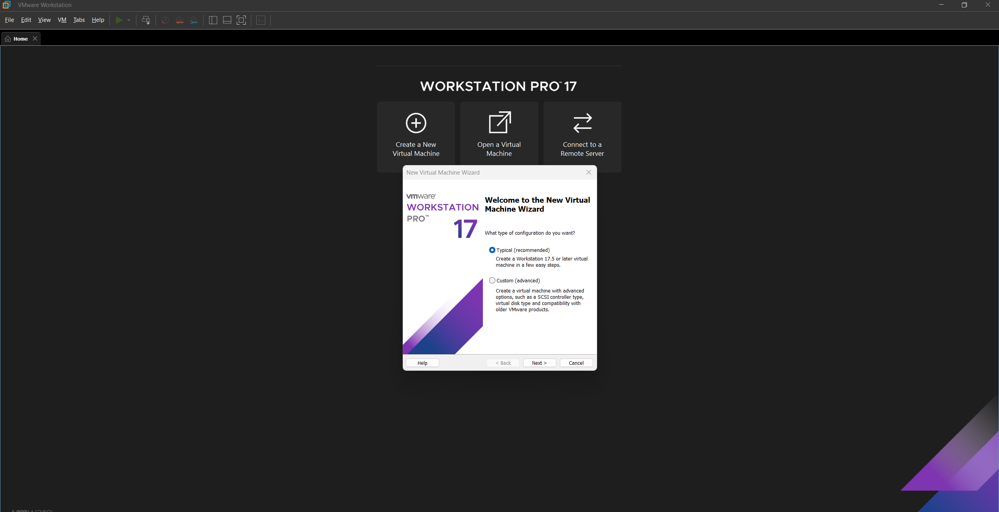  
  
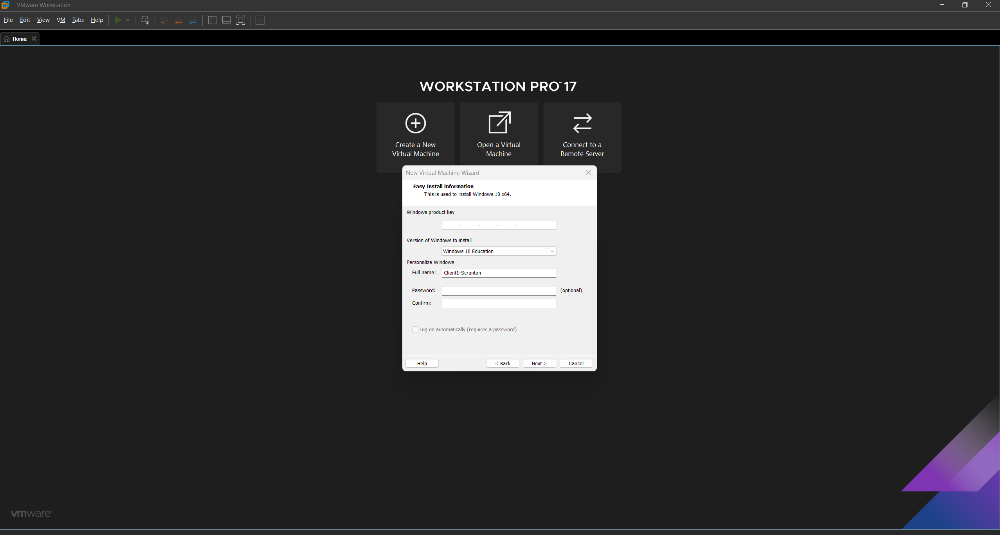  
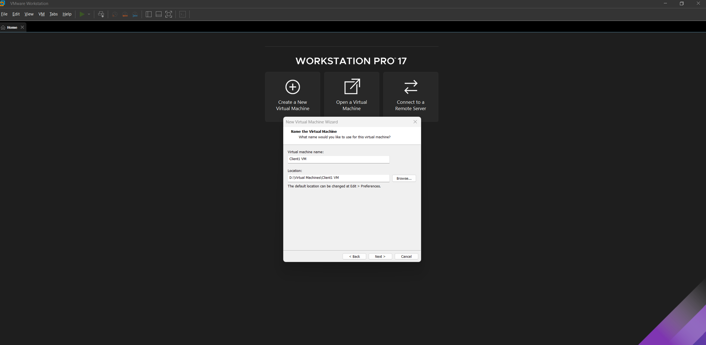  
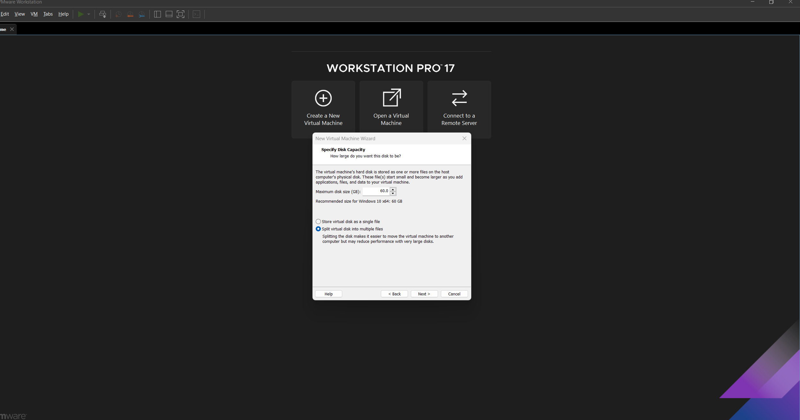  
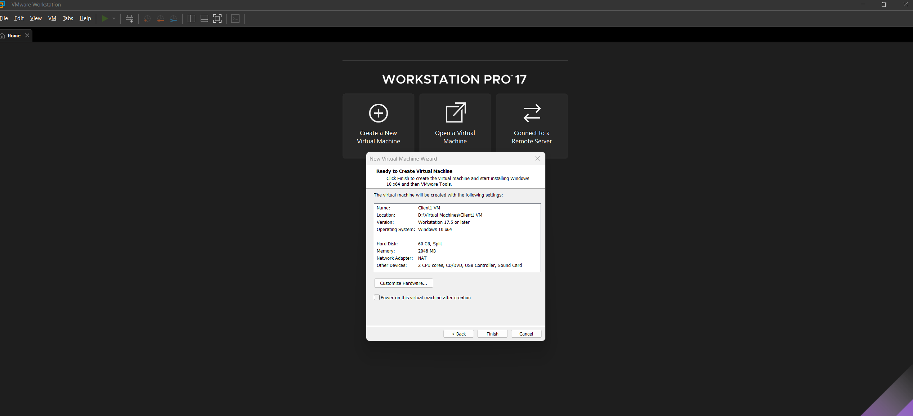  
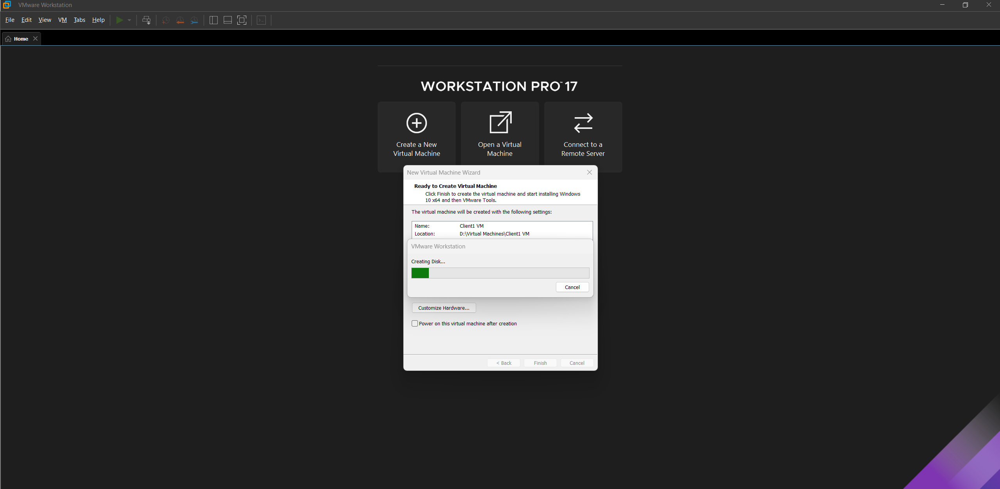  
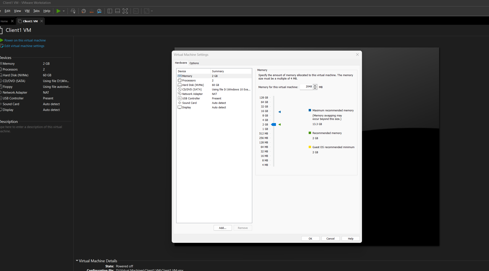  
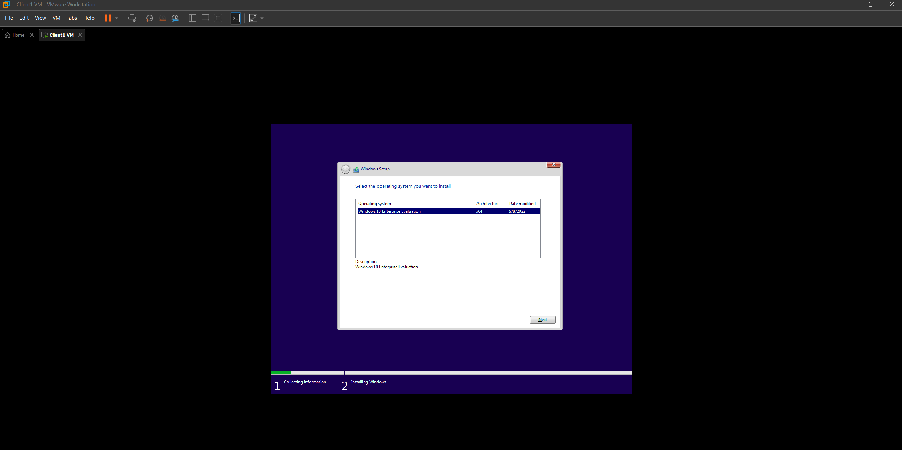  
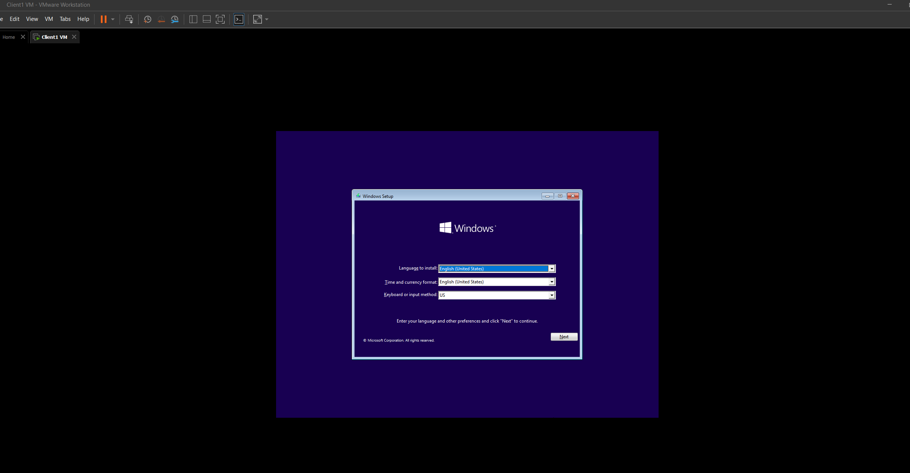  
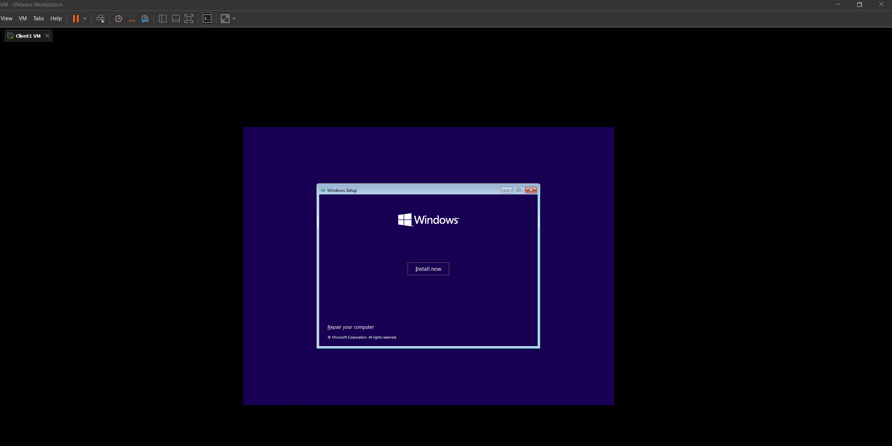  
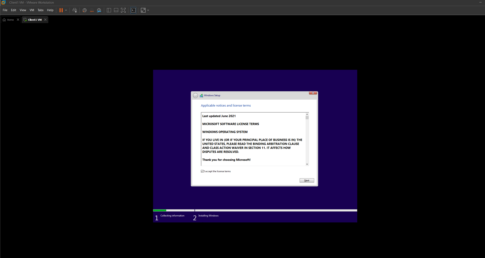  
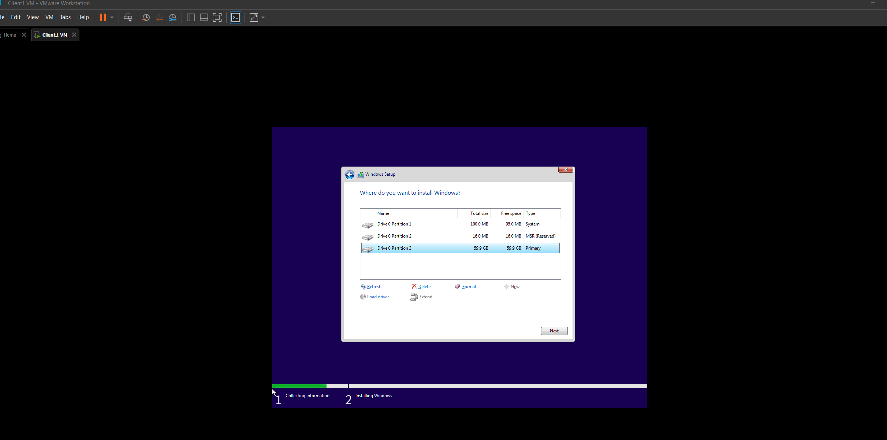  
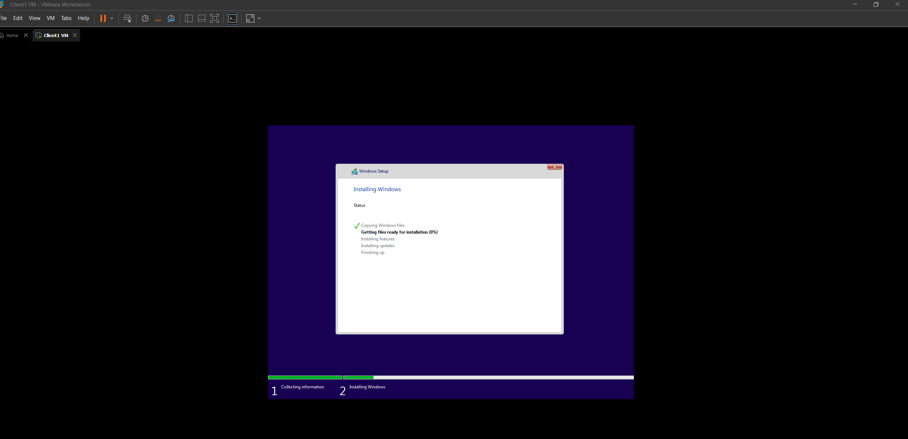  
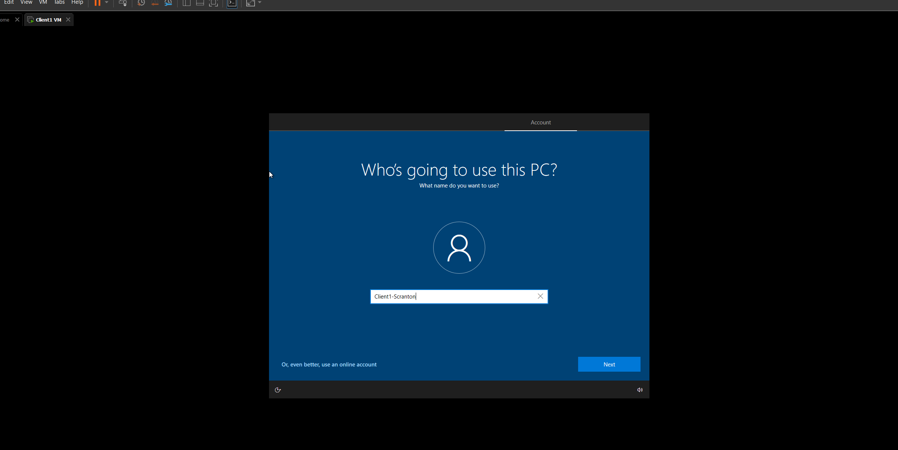  
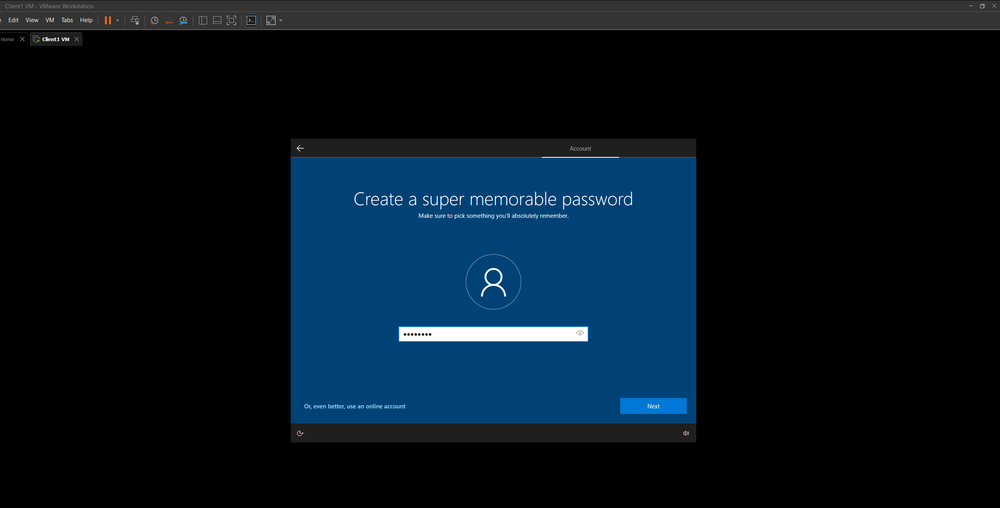  
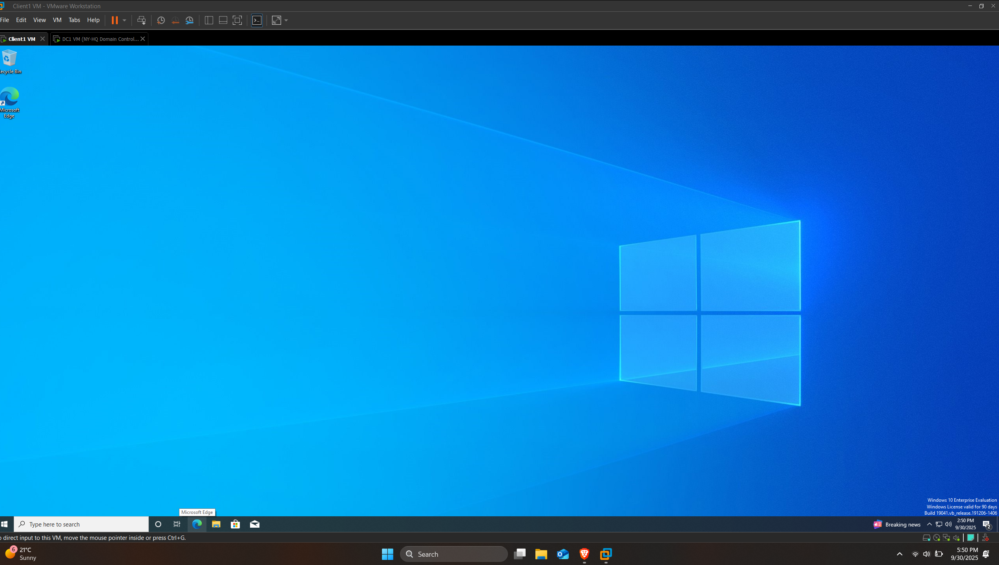  
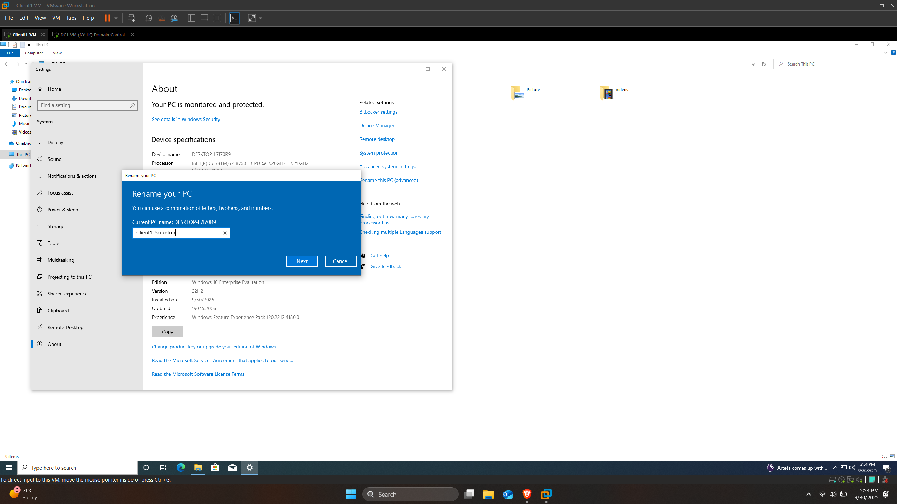  
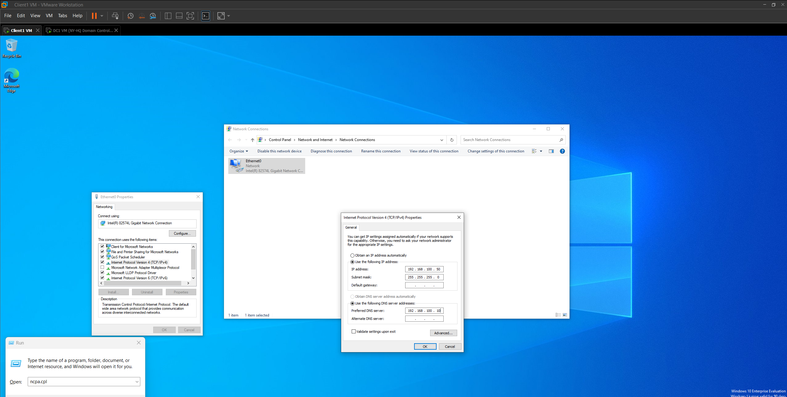  
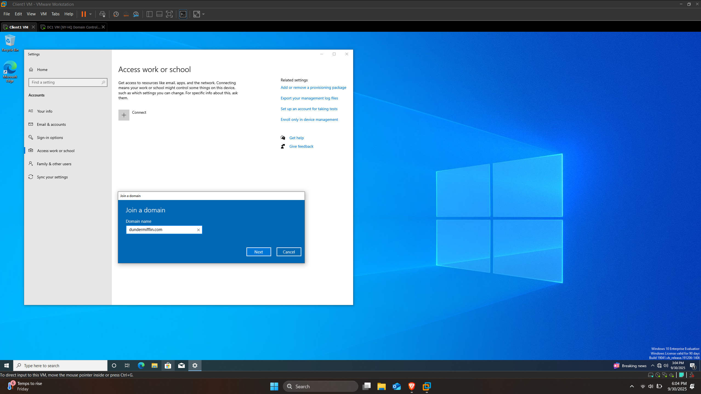  
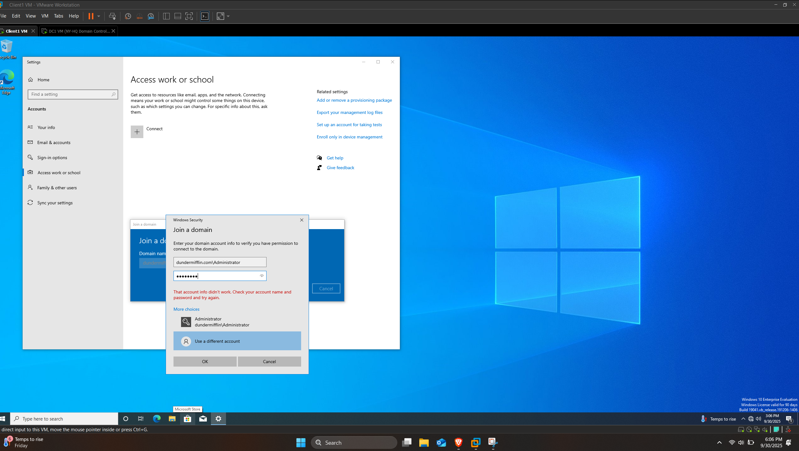  
  

