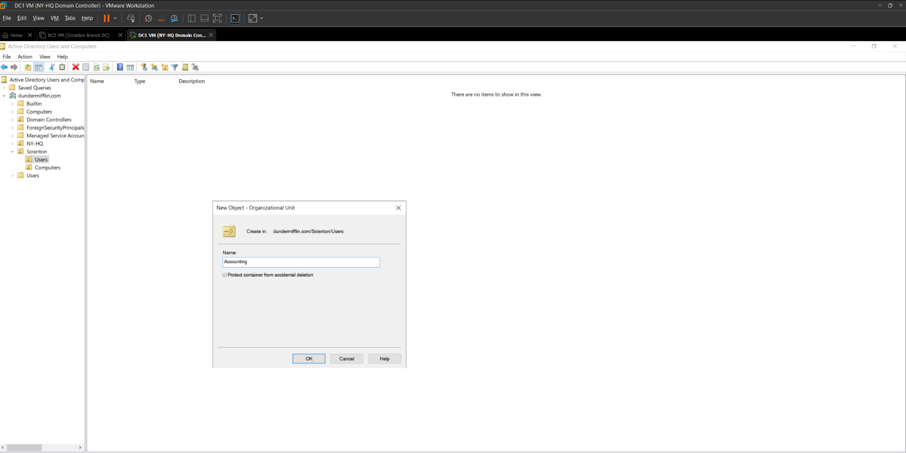

DC1-NYHQ — Overview

VM name: DC1-NYHQ

Purpose: Primary writable Domain Controller (first DC in the forest)

OS: Windows Server 2022 (Desktop Experience)

vCPU / RAM / Disk: 2 vCPU / 2 GB RAM (I recommend 4 GB if host can spare it) / 60 GB HDD

Network: VMware NAT network (lab subnet 192.168.100.0/24)

Static IP: 192.168.100.10

Hostname: DC1-NYHQ

Domain to create: dundermifflin.com

Snapshots: I take a VMware snapshot after each major milestone: (1) VM created & OS installed, (2) after renaming & IP configured, (3) after AD DS install & promotion.

1 — Create the VM in VMware Workstation Pro 17

Open VMware Workstation Pro 17 → File → New Virtual Machine.

Choose Typical (recommended) → Next.

Select Installer disc image file (iso) and point to your Windows Server 2022 ISO → Next.

Guest OS: Microsoft Windows → choose Windows Server 2022 (x64) → Next.

Give the VM a name: DC1-NYHQ. Choose a location with enough disk space → Next.

Disk capacity: set 60 GB (single file is fine).

Click Customize Hardware:

Processors: 2 vCPUs

Memory: 2048 MB (2 GB) — I recommend 4096 MB (4 GB) if you have room.

Network Adapter: Select NAT (so VMs all sit on the NAT subnet, e.g., 192.168.100.x).

CD/DVD (SATA): Point to the Windows Server 2022 ISO if not already set.

Finish and Power on the VM.

Screenshot placeholder: ../screenshots/dc1-vm-settings.png

2 — Install Windows Server 2022

Boot the VM — the Windows installer launches from the ISO.

Select language/region/keyboard → Next → Install now.

Choose Windows Server 2022 Standard (Desktop Experience) (GUI) — this makes AD tools easier to use in the lab.

Accept license terms → Custom: Install Windows only (advanced).

Select the 60 GB disk → New (if you want to partition) → Next. Installation runs and reboots automatically.

On first boot, set a secure local Administrator password when prompted. Use a strong DSRM password later when promoting the DC.

After first login, install VMware Tools (VM → Install VMware Tools) to enable better network and clipboard support.

Screenshot placeholder: ../screenshots/dc1-install-windows.png

Snapshot: After Windows install and VMware Tools, I take a snapshot named post-install.

3 — Rename the server (hostname) & reboot

I always rename before doing network/DNS work.

GUI method:

Start → Settings → System → About → Rename this PC.

Enter DC1-NYHQ → Restart now when prompted.

PowerShell method (elevated):

Rename-Computer -NewName "DC1-NYHQ" -Restart

After reboot, confirm hostname:

hostname
# or
(Get-CimInstance Win32_ComputerSystem).Name

4 — Configure static IP and DNS

Important: For a domain controller, DNS should point to the DC itself (its IP) so the server resolves domain records locally after promotion.

4.1 GUI steps (Windows Settings)

Settings → Network & Internet → Ethernet (or Control Panel → Network Connections → right-click adapter → Properties).

Click Change adapter options → Right-click your network adapter → Properties.

Select Internet Protocol Version 4 (TCP/IPv4) → Properties.

Choose Use the following IP address and enter:

IP address: 192.168.100.10

Subnet mask: 255.255.255.0

Default gateway: 192.168.100.1 (the VMware NAT gateway for the NAT network)

Preferred DNS server: 192.168.100.10 (point DNS to this server itself)

Click OK → Close.

4.2 PowerShell (alternative)

Run PowerShell as Administrator:

$iface = Get-NetAdapter | Where-Object {$_.Status -eq 'Up'} 
# Confirm the correct interface if multiple exist
New-NetIPAddress -InterfaceIndex $iface.ifIndex -IPAddress 192.168.100.10 -PrefixLength 24 -DefaultGateway 192.168.100.1
Set-DnsClientServerAddress -InterfaceIndex $iface.ifIndex -ServerAddresses 192.168.100.10

Verify:

ipconfig /all
nslookup dundermifflin.com 192.168.100.10

Screenshot placeholder: ../screenshots/dc1-static-ip.png

Snapshot: Take post-ip-config snapshot.

5 — Install Active Directory Domain Services (AD DS)

I use Server Manager for clarity, but include PowerShell steps below.

5.1 Install AD DS role (Server Manager - GUI)

Open Server Manager → Manage → Add Roles and Features.

Role-based or feature-based installation → Next → Select server (DC1-NYHQ) → Next.

Under Server Roles, check Active Directory Domain Services. When prompted, click Add Features to include required management tools.

Click Next → Install. Wait for installation to complete. Don’t close Server Manager.

5.2 Promote the server to a domain controller (first DC — new forest)

In Server Manager, click the Notifications flag → Promote this server to a domain controller.

Select Add a new forest → Root domain name: dundermifflin.com.

Set Forest functional level and Domain functional level to Windows Server 2022 (matching the OS).

Enter a secure Directory Services Restore Mode (DSRM) password (store it securely — you will need it for Directory Services recovery).

DNS options: the wizard will install DNS by default — accept. Global Catalog (GC): leave enabled (default). Do not mark as Read-only (this is the writable DC).

NetBIOS name will be auto-populated (e.g., DUNDERMIFFLIN) — accept or edit if you prefer.

Paths: accept default NTDS, SYSVOL locations or customize.

Review prerequisites — fix any blocking warnings, then click Install. The server will reboot automatically.

Note: The wizard will configure DNS and create the dundermifflin.com forward lookup zone and SRV records.

5.3 PowerShell alternative (automated)

If you prefer to run it in one shot (elevated PowerShell):

Install-WindowsFeature AD-Domain-Services -IncludeManagementTools

# Create a secure DSRM password - DON'T hardcode in production
$dsrm = ConvertTo-SecureString "YourStrongDSRMpassword!" -AsPlainText -Force

Install-ADDSForest `
  -DomainName "dundermifflin.com" `
  -SafeModeAdministratorPassword $dsrm `
  -DomainNetbiosName "DUNDERMIFFLIN" `
  -InstallDns:$true `
  -CreateDnsDelegation:$false
# The command will prompt you to confirm and then reboot once done.

Replace YourStrongDSRMpassword! with a secure value and never commit real passwords to the repo.

Screenshot placeholder: ../screenshots/dc1-promo.png

6 — Post-promotion verification

After the DC reboots and I log in as Administrator, I run the following checks and record their outputs in my lab notes.

6.1 Basic AD & DC checks
# AD module must be available on the DC
Import-Module ActiveDirectory

# Confirm domain exists
Get-ADDomain

# List domain controllers and confirm this one is writable
Get-ADDomainController -Filter * | Format-Table Name,HostName,Site,IsReadOnly,IPv4Address

# Check AD health
dcdiag /v

# Check replication status (single DC -> minimal output)
repadmin /replsummary

6.2 DNS checks
# DNS service state
Get-Service -Name DNS

# Query DNS for domain
nslookup dundermifflin.com 192.168.100.10

# Check SRV records (use nslookup or DNS Manager GUI)
nslookup -type=SRV _ldap._tcp.dc._msdcs.dundermifflin.com 192.168.100.10

6.3 SYSVOL & NETLOGON shares
# Confirm domain shares exist
net share
# Expect SYSVOL and NETLOGON listed

6.4 Event Viewer

Open Event Viewer → Windows Logs → System / Directory Service and check for errors/warnings related to AD DS, DNS, or NETLOGON.

7 — Common adjustments I perform immediately

Time sync: ensure the DC is syncing time correctly. I run:

w32tm /query /status
w32tm /resync

DNS client: I confirm the DC points to itself as DNS:

Get-DnsClientServerAddress

Firewall: if I have connectivity issues with additional DCs or clients, I confirm Windows Firewall allows AD/DNS ports or temporarily disable for testing:

Set-NetFirewallProfile -Profile Domain,Public,Private -Enabled False
# (Only disable temporarily for lab troubleshooting.)

8 — Snapshot & backup

I take a final snapshot named post-DC-promotion after verifying AD, DNS, SYSVOL and NETLOGON. This gives me a rollback point if I later add RODCs or make changes.

9 — Troubleshooting tips (quick reference)

DNS resolution problems — Clients and additional DCs must use this DC’s IP as Preferred DNS. If clients point at external DNS, domain join will fail.

Domain not found on join — nltest /dsgetdc:dundermifflin.com helps locate the DC. Verify DNS SRV records exist.

Replication issues (future multi-DC) — repadmin /showrepl and dcdiag /v are my go-to commands.

Time skew — Kerberos/Logon issues often come from clock drift. Use w32tm /resync.

If promotion fails due to DNS delegation — it’s usually safe to continue (the wizard warns if the parent zone cannot be created). For a new forest, select no for delegation.

10 — What I document / upload to the repo

../screenshots/dc1-vm-settings.png — VM hardware settings in VMware (CPU/RAM/disk/network).

../screenshots/dc1-install-windows.png — Windows setup screens (edition selection, partition).

../screenshots/dc1-static-ip.png — IPv4 properties with static IP and DNS pointing to 192.168.100.10.

../screenshots/dc1-promo.png — AD DS promotion wizard (summary page) and post-install Server Manager showing AD role installed.

A short dc1-checks.txt containing outputs of Get-ADDomain, Get-ADDomainController -Filter *, dcdiag /v.

Security: before uploading screenshots, I scrub or blur any passwords, product keys or sensitive hostnames.

11 — Quick command cheat-sheet (copyable)
# Rename computer and restart
Rename-Computer -NewName "DC1-NYHQ" -Restart

# Set static IP and DNS (run elevated)
$iface = Get-NetAdapter | Where-Object {$_.Status -eq 'Up'}
New-NetIPAddress -InterfaceIndex $iface.ifIndex -IPAddress 192.168.100.10 -PrefixLength 24 -DefaultGateway 192.168.100.1
Set-DnsClientServerAddress -InterfaceIndex $iface.ifIndex -ServerAddresses 192.168.100.10

# Install AD DS role
Install-WindowsFeature AD-Domain-Services -IncludeManagementTools

# Promote to new forest (example)
$dsrm = Read-Host -AsSecureString "Enter DSRM password"
Install-ADDSForest -DomainName "dundermifflin.com" -SafeModeAdministratorPassword $dsrm -DomainNetbiosName "DUNDERMIFFLIN" -InstallDns:$true

# Health checks
Get-ADDomain
Get-ADDomainController -Filter *
dcdiag /v
repadmin /replsummary

Final note

This VM becomes the authoritative source for the dundermifflin.com domain. Keep the VM powered on while you add DC2-Scranton as an RODC and while you join clients. I document every command output and screenshot and upload them under docs/ and screenshots/ so recruiters can validate the work visually.

  
  
  
  
  
  
  
  
  
  
  
  
  
  
  
  
  
  
  
  
  
  
  
  
  
  
  
  
  
  
  
  
  
  
  
  
  
  
  
  
  
  
  
  
  
  
  
  
  
  
  
  
  
  
  
  
  
  
  
  
  
  
  
  
  
  
  
  
  
  
  
  

