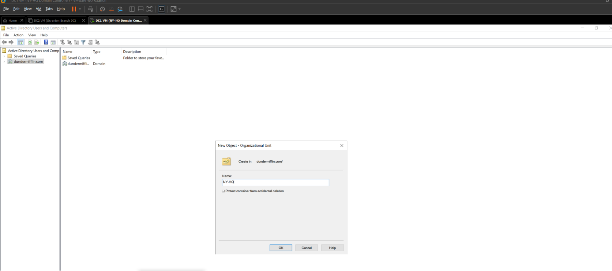
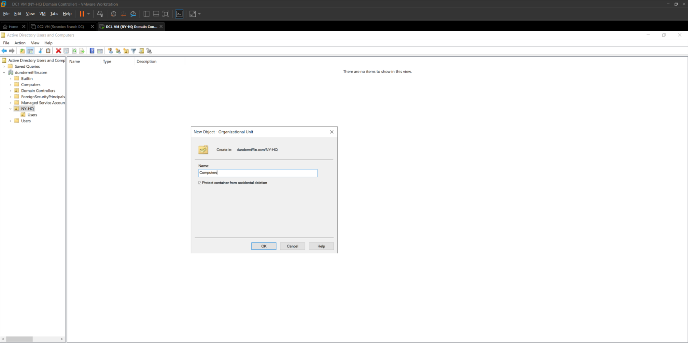
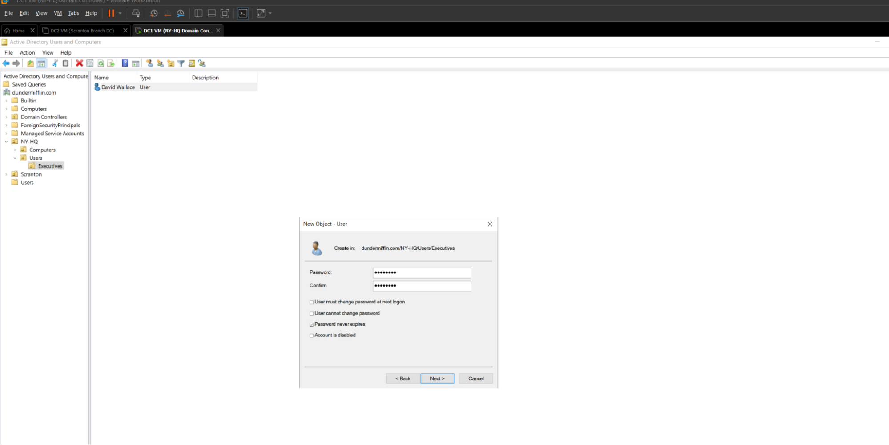
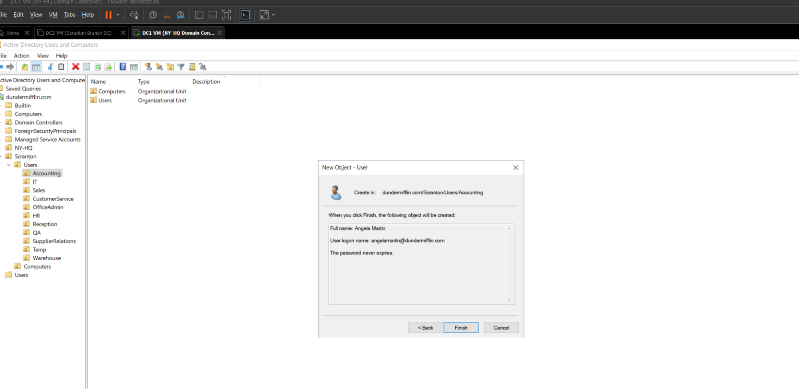
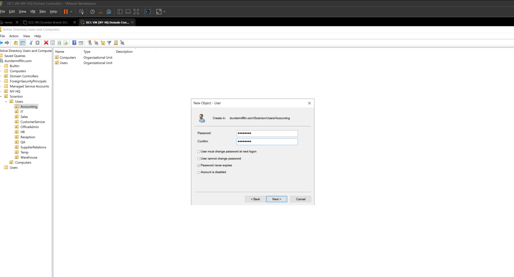
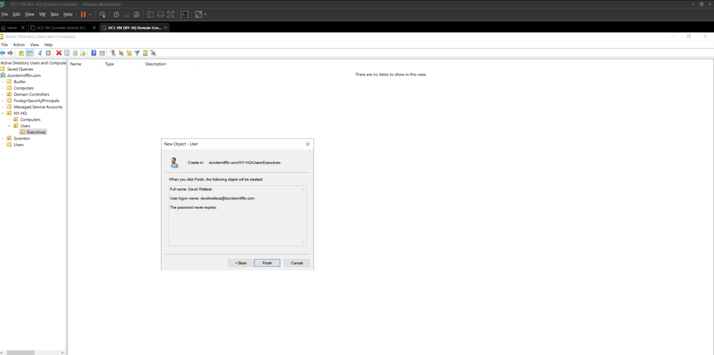

# Organizational Units, Groups, and Users Setup

This document explains how I created the **OU (Organizational Unit) structure**, **groups**, and **users** in my Active Directory lab. Everything was built to simulate a realistic enterprise domain setup for **Dunder Mifflin Paper Company**.

---

## 1. Opening Active Directory Users and Computers (ADUC)

1. From the **Domain Controller (DC1)**, I opened:
   - `Start` > `Windows Administrative Tools` > **Active Directory Users and Computers**.
2. Verified that I was connected to the correct domain:
   - **dundermifflin.com**

---

## 2. Creating the OU Structure

I built out two major branches in the domain: **NY-HQ** (Headquarters) and **Scranton** (Branch).  

Here’s the final OU structure:

dundermifflin.com
│
├── NY-HQ
│ ├── Computers
│ └── Users
│ ├── Executives
│ └── Groups
│
└── Scranton
├── Computers
└── Users
├── Accounting
├── CustomerService
├── Groups
│ ├── AccountingGroups
│ ├── ExecutiveGroups
│ ├── HRGroups
│ ├── InternGroups
│ ├── QAGroups
│ ├── SalesGroups
│ └── SupplierRelationsGroups
├── HR
├── Interns
├── IT
├── Management
├── OfficeAdmin
├── QA
├── Reception
├── Sales
├── SupplierRelations
├── Temp
└── Warehouse

### Steps to Create Each OU:
1. Right-clicked the **domain root (`dundermifflin.com`)**.
2. Selected **New > Organizational Unit**.
3. Named the OU (e.g., `NY-HQ`, `Scranton`).
4. Repeated the process for sub-OUs like `Accounting`, `Sales`, `Groups`, etc.
5. Enabled **Protect container from accidental deletion** to safeguard each OU.

---

## 3. Creating Groups

I organized groups inside the **Scranton > Users > Groups** container. Each department has its own subgroup:

- **AccountingGroups**
- **ExecutiveGroups**
- **HRGroups**
- **InternGroups**
- **QAGroups**
- **SalesGroups**
- **SupplierRelationsGroups**

### Steps to Create Groups:
1. Right-clicked on the OU `Groups` (or a subgroup like `AccountingGroups`).
2. Selected **New > Group**.
3. Entered the group name (e.g., `Accounting-Staff`).
4. Chose:
   - **Group scope:** Global
   - **Group type:** Security
5. Repeated for all groups.

---

## 4. Creating Users

I added users to simulate real Dunder Mifflin employees and executives.

### Users in **NY-HQ > Users > Executives**
- **Andy Bernard**
- **Dwight Schrute**
- **Jim Halpert**
- **Phyllis Lapin**
- **Stanley Hudson**

### Example Department Users (Scranton)
- **Accounting**: Users for the accounting department (e.g., Angela Martin, Oscar Martinez).
- **CustomerService**: Users for support roles.
- **HR**: Toby Flenderson, Kelly Kapoor.
- **Sales**: Michael Scott, Pam Beesly, Ryan Howard, etc.
- **Warehouse**: Darryl Philbin and warehouse staff.

> (Note: For demonstration, I limited the number of users in each department, but in a real environment, each OU would contain the appropriate set of employees.)

### Steps to Create Each User:
1. Right-clicked on the target OU (e.g., `Scranton > Users > Sales`).
2. Selected **New > User**.
3. Entered:
   - **First Name, Last Name**
   - **User logon name** (e.g., `jhalpert`)
4. Assigned a secure **initial password**.
5. Checked **User must change password at next logon**.
6. Finished the wizard.
7. Added users to the proper group:
   - Right-click user > **Add to a group** > e.g., `SalesGroups`.

---

## 5. Verification

- Confirmed the OU hierarchy was correct in **Active Directory Users and Computers**.
- Logged in with test user accounts on **client machines** to validate domain connectivity.
- Verified group memberships were applied properly.

  
  
  
  
  
  
  
  
  
  
  
  
  
  
  
  
  
  
  
  
  
  
  
 

---

✅ This OU and group structure mirrors a **real enterprise environment**, providing separation by department, role, and location. It also lays the foundation for applying **Group Policy Objects (GPOs)** and configuring **role-based access control (RBAC)** in the lab.
